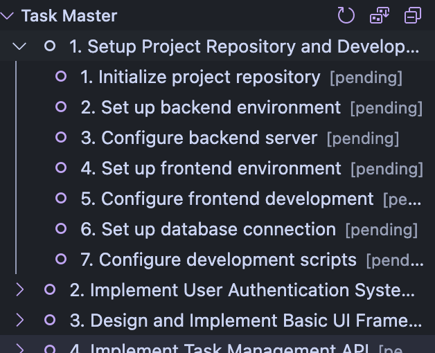

# Task Master Viewer

A Visual Studio Code extension that provides a graphical interface for viewing and managing Task Master tasks directly within VS Code.

> **🤖 About This Project**  
> This project was created to test the capabilities of Claude Code and Claude Opus 4. The author had **zero prior experience** in developing VS Code extensions before this project. This extension was built **100% through pair programming with Claude**, demonstrating the power of AI-assisted development. Every line of code, from initial setup to advanced features, was written through natural language conversations with Claude.



## Features

- **📋 Task Tree View**: Display all Task Master tasks in an organized tree structure within the Explorer sidebar
- **🎯 Visual Status Indicators**: Color-coded icons for different task states:
  - ✅ Completed (green)
  - 🔄 In-progress (blue, animated)
  - ❌ Blocked (red)
  - ⭕ Pending (gray outline)
- **🔢 Task ID Display**: Task numbers displayed prominently at the beginning of each task title
- **📂 Nested Subtasks**: Collapsible tree structure showing task hierarchy with subtasks
- **🖱️ Click to Open**: Click any task to open its corresponding file (task_001.txt, etc.) in the editor
- **🔀 Flexible Sorting**: Sort tasks by ID, Priority, Status, or Title with a dropdown menu
- **🔄 Quick Status Updates**: Right-click context menu to change task status instantly
- **🔍 Auto-refresh**: Real-time updates when task files are modified
- **📁 Multi-format Support**: Works with JSON (including tasks.json), Markdown, and individual task files

## Requirements

- Visual Studio Code 1.74.0 or higher
- A workspace with Task Master initialized (`.taskmaster` directory present)

## Installation

1. Open VS Code
2. Press `Ctrl+P` / `Cmd+P` to open Quick Open
3. Type `ext install task-master-viewer`
4. Press Enter and click Install

## Usage

1. **Open a Task Master Project**: Open any workspace containing a `.taskmaster` directory
2. **View Tasks**: The "Task Master" panel will appear in the Explorer sidebar
3. **Navigate Tasks**: 
   - Click on any task to open its file in the editor
   - Expand/collapse tasks with subtasks using the arrow icon
   - Task IDs are shown at the beginning of each title (e.g., "1. Setup Project...")
4. **Sort Tasks**: Click the sort button (📊) in the panel header to choose sorting order:
   - ID (Task Number)
   - Priority (Critical → High → Medium → Low)
   - Status (In-progress → Pending → Blocked → Completed)
   - Title (Alphabetical)
5. **Refresh Tasks**: Click the refresh button (🔄) in the panel header to reload tasks
6. **Update Status**: Right-click any task and select "Update Status" to change its state

## Supported Task Formats

### tasks.json Format (Task Master)
```json
{
  "tasks": [
    {
      "id": 1,
      "title": "Implement feature X",
      "description": "Detailed description of the task",
      "status": "pending",
      "priority": "high",
      "dependencies": [2, 3],
      "subtasks": [
        {
          "id": 1,
          "title": "Design API endpoints",
          "status": "pending"
        },
        {
          "id": 2,
          "title": "Implement backend logic",
          "status": "in-progress"
        }
      ]
    }
  ]
}
```

### Individual JSON Format
```json
{
  "id": "task-001",
  "title": "Implement feature X",
  "description": "Detailed description of the task",
  "status": "pending",
  "priority": "high",
  "dependencies": ["task-000"],
  "tags": ["feature", "backend"]
}
```

### Markdown Format
```markdown
# Task Title

Detailed description of the task goes here...

status: pending
priority: medium
tags: frontend, ui
```

## Commands

| Command | Description | Shortcut |
|---------|-------------|----------|
| `Task Master: Refresh Tasks` | Reload all tasks from disk | Click refresh button |
| `Task Master: Sort Tasks` | Choose task sorting order | Click sort button |
| `Task Master: Update Status` | Change task status | Right-click on task |
| `Task Master: Open Task File` | Open task file in editor | Click on task |

## Configuration

This extension currently has no configurable settings. All tasks are automatically loaded from the `.taskmaster` directory in your workspace root.

## Development

### Building from Source

```bash
# Clone the repository
git clone https://github.com/roboco-io/task-master-viewer.git
cd task-master-viewer

# Install dependencies
npm install

# Compile TypeScript
npm run compile

# Run in development mode
npm run watch
```

### Testing

Press `F5` in VS Code to launch the Extension Development Host with the extension loaded.

## Known Issues

- Currently supports only single workspace folders (multi-root workspaces not yet supported)
- Task files must be located in `.taskmaster` directory at workspace root
- Large numbers of tasks (>1000) may impact performance

## Troubleshooting

**Tasks not appearing?**
- Ensure `.taskmaster` directory exists in your workspace root
- Check that task files have `.json` or `.md` extensions
- Click the refresh button to reload tasks

**Status updates not working?**
- Verify you have write permissions to the task files
- Check VS Code output panel for error messages

## Contributing

Contributions are welcome! Please feel free to submit issues and pull requests.

## License

This extension is licensed under the MIT License.

## Release Notes

### 0.0.2 (Latest)

- Added click-to-open functionality for task files
- Implemented nested subtask display with collapsible tree structure
- Added task ID display at the beginning of titles
- Introduced flexible sorting system (ID, Priority, Status, Title)
- Added support for tasks.json format from Task Master
- Improved task file discovery and parsing logic
- Added sort button in panel header with dropdown selection

### 0.0.1

- Initial release of Task Master Viewer
- Basic task viewing functionality
- Status update support
- Priority-based sorting
- Auto-refresh on file changes